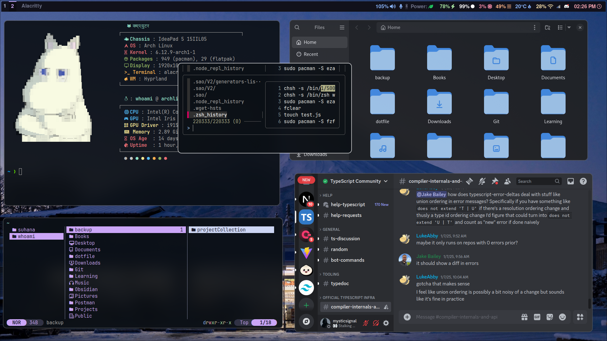
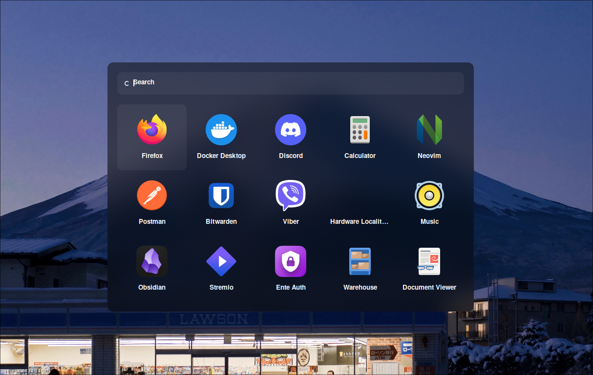

# 🚀 My Dotfiles

This repository contains my personal dotfiles for my Linux setup. These configurations are primarily focused on creating a productive and aesthetically pleasing development environment using Hyprland as the window manager.

# Image Preivew

<div align="center">
  
  
</div>

## 📦 Components

- **Terminal**: Alacritty
- **Window Manager**: Hyprland
- **Lock Screen**: Hyprlock
- **Wallpaper Manager**: Hyprpaper
- **Idle Management**: Hypridle
- **Status Bar**: Waybar
- **Application Launcher**: Rofi
- **Terminal Multiplexer**: Tmux
- **Shell**: Zsh with Oh-My-Zsh
- **Text Editor**: Neovim (LazyVim configuration)
- **File Manager**: Yazi
- **Git TUI**: Lazygit
- **System Fetch**: Fastfetch
- **Notification Center**: SwaynC

## 🛠️ Prerequisites

Before installing these dotfiles, ensure you have the following packages installed on your system:

### For Arch-based systems:

```bash
sudo pacman -S git base-devel stow

# Core components
sudo pacman -S alacritty hyprland waybar rofi tmux zsh neovim yazi lazygit

# Hyprland utilities
sudo pacman -S hyprlock hyprpaper hypridle

# Additional tools
sudo pacman -S fastfetch swaync ueberzugpp
```

## 📥 Installation

1. **Clone the repository:**

```bash
git clone https://github.com/yourusername/dotfiles.git ~/.dotfiles
cd ~/.dotfiles
```

2. **Install Oh-My-Zsh:**

```bash
sh -c "$(curl -fsSL https://raw.githubusercontent.com/ohmyzsh/ohmyzsh/master/tools/install.sh)"
```

3. **Install Powerlevel10k theme:**

```bash
git clone --depth=1 https://github.com/romkatv/powerlevel10k.git ${ZSH_CUSTOM:-$HOME/.oh-my-zsh/custom}/themes/powerlevel10k
```

4. **Install LazyVim:**

```bash
# Backup your existing Neovim configuration
mv ~/.config/nvim ~/.config/nvim.backup

# Clone LazyVim starter
git clone https://github.com/LazyVim/starter ~/.config/nvim
rm -rf ~/.config/nvim/.git
```

5. **Install Hyprshot (Optional - for screenshots):**

```bash
git clone https://github.com/Gustash/hyprshot.git ~/.local/src/hyprshot
ln -s ~/.local/src/hyprshot/hyprshot ~/.local/bin
chmod +x ~/.local/bin/hyprshot
```

6. **Create symlinks using GNU Stow:**

```bash
cd ~/.dotfiles
stow .
```

## 📁 Directory Structure

```
dotfile/
├── .config/
│   ├── alacritty/
│   ├── avatar/
│   ├── fastfetch/
│   ├── hypr/
│   ├── lazygit/
│   ├── nvim/
│   ├── rofi/
│   ├── swaync/
│   ├── tmux/
│   ├── wallpaper/
│   ├── waybar/
│   ├── yazi/
├── .git/
├── preview/
├── .p10k.zsh
├── .stow-local-ignore
├── .zshrc
├── README.md

```

## ⚙️ Post-Installation

1. Launch Zsh and configure Powerlevel10k:

```bash
zsh
```

2. Start Neovim to initialize LazyVim:

```bash
nvim
```

3. Set your wallpaper in `~/.config/hypr/hyprpaper.conf`

## 🎨 Customization

- Wallpapers are stored in the `wallpapers/` directory
- Each application's configuration can be found in its respective directory under `.config/`
- Zsh configuration is managed through `.zshrc`
- Powerlevel10k theme configuration is in `.p10k.zsh`

## 📝 Notes

- Make sure to install the necessary fonts for Powerlevel10k
- Some configurations might need adjustments based on your hardware
- Backup your existing configurations before using these dotfiles

## 🔄 Updating

To update the configurations:

```bash
cd ~/.dotfiles
git pull
stow .
```

## 📜 License

This project is licensed under the MIT License - see the LICENSE file for details.
